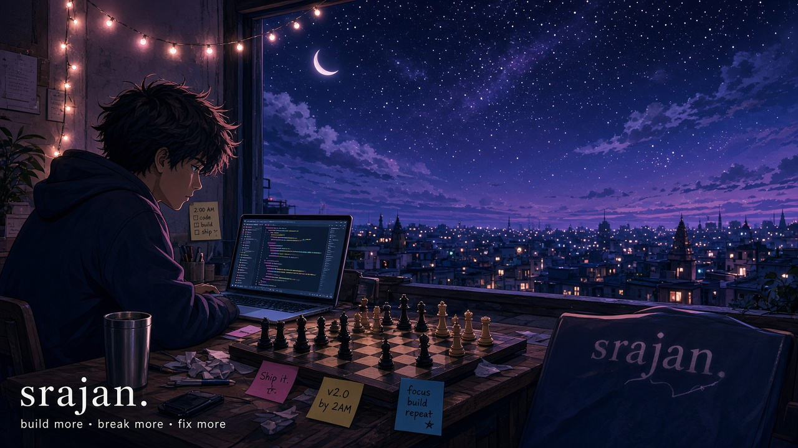
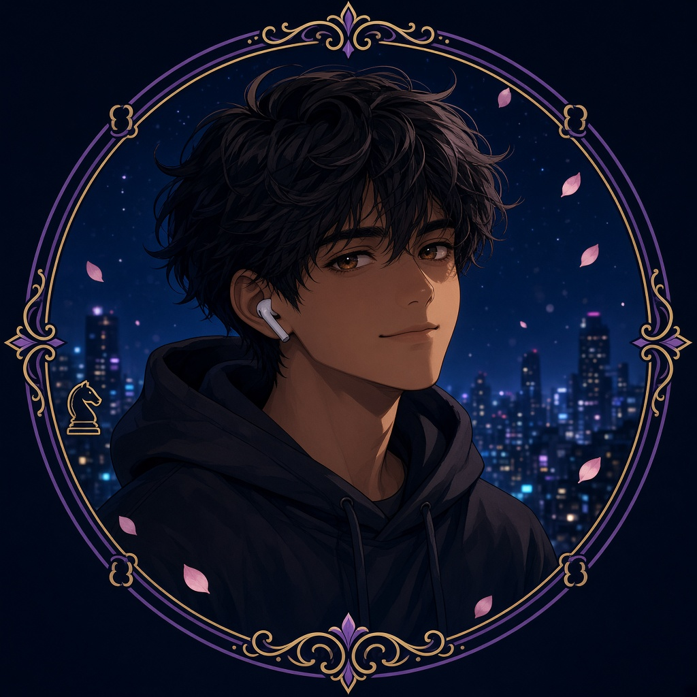
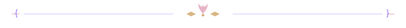

  
   
  

  # srajan gupta
  ### ⊹ ⋆ ˚｡⋆  build more. break more. fix more.  ⋆｡˚ ⋆ ⊹

  

   

  
  
  
  
  

  

 

> 🌙 4th year CSE · Prayagraj · chess ~1700  
> ⚔️ full-stack at [uncensored](https://uncensored.com) · previously sold [dailygeeta.com](https://www.dailygeeta.com)  
> ♟️ i ship products, talk to users, and sell the ones that work.

i built dailygeeta — a gita-in-your-inbox saas — got **20+ paid users**, then sold it. the rest of this page is things that actually went live.

### ⋆｡˚ ꕤ  shipped

<table>
<tr>
<td width="50%">

🎮 **[dailygeeta](https://www.dailygeeta.com)**  
one shloka every morning, hindi + english, written for people who don't read scripture. 120+ signups, 20+ paid, then acquired.

⚖️ **[saarthi](https://github.com/creation22/saarthi)**  
free legal ai for india. ask in 12 languages, get answers cited to actual statutes, generate firs and notices as pdf.

🔔 **[workping](https://workping.vercel.app)**  
chrome extension that telegrams people when you go into work mode, so they stop calling. [chrome web store](https://chromewebstore.google.com/detail/workping/fknebhdaeggbjkkiallkdcaggfnbiddn)

🎬 **[marvel timeline](https://marveltimeline.space)**  
watch order, character appearances, phases and sagas — the mcu in one place.

</td>
<td width="50%">

🌸 **[dreamher](https://dreamher.vercel.app)**  
10 questions in, an ai portrait out. the repo people star for some reason.

🕉️ **[daily shlok](https://daily-shlok.vercel.app)**  
a new gita verse on every load, with a goal countdown and bookmarks. the prototype that became dailygeeta.

🛺 **[rupee rush](https://rupeerush.srajan.online)**  
an auto rickshaw that drives over hills made from historical usd/inr rates. throttle only.

📉 **[bunkbuddy](https://bunkbuddy-pi.vercel.app)**  
how many classes you can skip and still hit 75%. written because i was tired of doing the math by hand.

</td>
</tr>
</table>

  
  
  
  

### ⋆｡˚ ꕤ  also lying around

📓 [personal notebook](https://github.com/creation22/personal_notebook) — chat with pdfs, sites, and youtube via langchain + qdrant  
📊 [xlytics](https://xlytics.vercel.app) — growth analytics for x creators  
🧩 [tuf sheet](https://github.com/creation22/TUF-sheet-) — dsa notes that somehow have the most stars on this account  
🧷 [stickx](https://stickx.vercel.app) · 🤖 [altman gpt](https://altmangpt.vercel.app)

### ⋆｡˚ ꕤ  stack

  

 

javascript, typescript, react, next.js, node, python, c++.  
langchain, qdrant, firebase, postgres when the product needs a brain.

i pick the tool after the idea, not before.

### ⋆｡˚ ꕤ  stats

  
  
   
  
   
  

  ⋆｡˚ ꕤ  open to internships and full-time roles. if you want something built, say hi.  ꕤ ˚｡⋆
    
  

